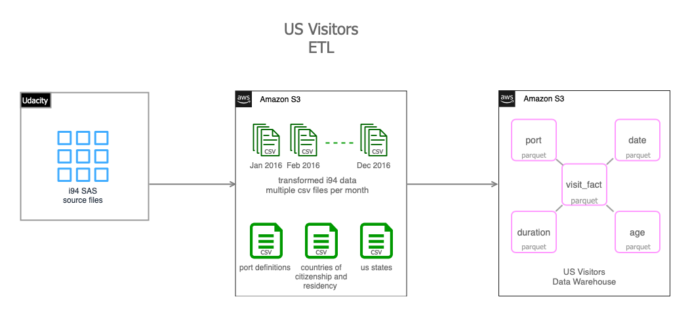
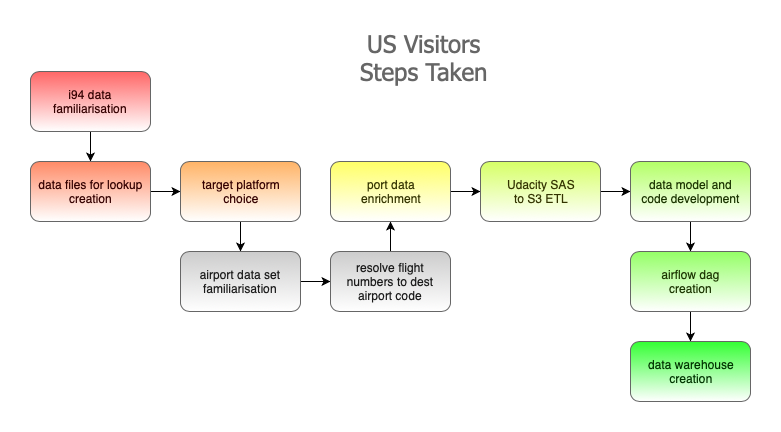

# Data Pipeline to Deliver i94 Visitor Data for Exploratory Analysis

Table of Contents
=================

  * [Description](#description)
  * [Installation](#installation)
  * [Usage](#usage)
  * [License](#license)
  * [Data Sources](#data-sources)

## Overview
This is the Capstone project for the Udacity data engineering nanodegree.  The purpose is to utilise skills and tools presented during the program.

The imagined scenario is the creation of an initial trial data warehouse for review by data scientists and data analysts at a consulting company specialising in Travel Business consulting and Tourism Marketing in the US.  The purpose of the data warehouse is threefold:
 * to enable geographical-based analysis and visualisation of foreign visitors to the US   
 * to explore the potential for state-specific data products based around foreign visitors to the US and the potential for combining with other geo-tagged data
 * to enable data scientists to explore the data and provide feedback on improvements and/or extensions to the data presented

 All foreign visitors to the US are required to fill in an I94 arrival/departure record. The primary data set available for the trial data warehouse was the i94 data set of visitors to the US in 2016.  This data set was combined with data defining the ports of entry and their geographical location to produce the trial data warehouse.  

 At a high level, from the SAS format i94 data stored in the Udacity workspace to the Data Warehouse files written as parquet format on Amazon S3 the project data pipeline is illustrated below.

## Steps Taken

 The project took the following steps:

 

 1. **Initial familiarisation with the i94 data.**  A small amount of data was explored locally in a Jupyter Notebook to get an understanding of the fields in the i94 data set, their types and any missing data in that small set.

 2. **Creation of lookup data sets.** the SAS description file was used to create lookup data sets for ports, first destination state and countries of citizenship and residency. Some basic regular expression matching was used in python in a Jupyter Notebook to separate out the state and the port name to enable future joining against city and state data.  At this stage of the data exploration these new lookup tables were joined with the i94 data again to enable familiarisation with the data set.

 3. **Decide on target platform.**  Taking into account the initial familiarity with the primary data set, the chosen imagined scenario, the technologies that had been covered in the course and the cost implications of various choices it was decided to pursue a solution using S3 for storage, Spark on EMR as the processing platform and Airflow running locally to orchestrate the data processing pipeline.

 3. **Exploration of the airports data set.**  The airports data set appeared useful since it provided latitude and longitude attributes for the airports and therefore fulfilled the requirement of providing geographical information about the ports in which foreign visitors were arriving in the US on flights.  There were several problems in joining the i94 data set with the airport data set including:
    * There was no common key for the ports at which flights were arriving and the airports they represented.  In only a small subset of cases, the port code matched the iata code for the airport.
    * Several of the US cities have multiple international airports: for example, George Bush Intercontinental, William P Hobby and Sugar Land Regional Airports in Houston, Texas all have customs facilities but the two ports in the i94 port data set in Houston are named as "HOUSTON, TX" and "HULL FIELD, SUGAR LAND ARPT, TX" so it would have been misleading to select, for example, the latitude and longitude of George Bush Intercontinental as the geographical location for arrivals at port code "HOU".

 4. **Development of code to obtain airport code for flights.**  Some code was developed to obtain the origin and destination airport iata codes by scraping the flightview.com http response returned from repeated searches using the airline and flight number fields of the i94 data set.  This was an interesting exercise but bore little fruit due to the fact that many of the flight numbers from 2016 were no longer used or had changed.  There are historical flight data sets available at a cost which may have been useful for resolving the arrival locations of international visitors to the US by air however these data sets were not purchased.

 5. **Enrichment of i94 port data set.**  The US cities and world cities data sets were downloaded from Simple Maps at  [https://simplemaps.com/data/us-cities](https://simplemaps.com/data/us-cities) and  [https://simplemaps.com/data/world-cities](https://simplemaps.com/data/world-cities) respectively.  These data sets were joined against the lookup port dataset created earlier to provide, amongst other things, latitude and longitude attributes for the relevant US and world cities.  However, many of the fields remained unmatched and these were then populated using a manual checking of various online sources including:
    * Wikipedia - this provided several Port of Entry matches with their latitude and longitude
    * Google Maps - provided latitude and longitude for several more obscure land crossing points and clarified certain ambiguous names by their geography
    * acukwik.com - resolved some airport queries
    * Google Search - provided a good starting point for more challenging port names

7. **Development of script to move SAS data to S3.** The Udacity work space is secure so, because of the choice of working with Amazon EMR as the processing platform, it was necessary to move the i94 data to S3.  This was done in a python script by reading the data in chunks from the SAS source and transferring multiple CSV files for each month to S3.

8. **Development of data model.**  A data model was developed conceptually then pyspark code was developed locally to create data warehouse tables on spark and write them to parquet format to implement the data model.

9. **Development of Airflow dags** to:
    * check data sources are in place
    * create an EMR cluster
    * add the relevant job steps to the EMR to:
      1. create the fact and dimension tables and write them to S3
      2. check that the parquet files have been created successfully with all the expected data
    * remove the EMR cluster

10. **Execution of Airflow dags to generate the data warehouse parquet files on S3.**

## Platform Choices and Justification

The following platforms were used during the project

 

**Amazon S3 and Amazon EMR and Spark for Trial Data Warehouse Platform**

This is a trial system involving Data Scientists and Data Analysts but with a large amount of data. By selecting Amazon EMR and Spark as the platform for Data Scientists this provides them with plenty of flexibility and a platform suitable for the size of the data set plus support for several machine learning algorithms as well the potential to explore graph databases and associated algorithms.  The data scientists is a small group so access to the system is more easily managed than for the Data Analysts.  

Given the focus on individual US states, it is simple to generate low cost csv files on a per state basis using Spark for the Data Analysts to investigate the current Data Warehouse data.  Alternatively, if the Data Analysts wanted more flexibility to work across larger sets of data the partitioning of the data and use of parquet as a storage format is well suited to using Amazon Athena and SQL-style querying that the analysts have some basic familiarity with while still keeping costs under control.  This is a good option for larger scale exploratory work on the trial Data Warehouse.

Once feedback has been received and any schema or aggregation changes implemented it would be possible to update the data pipeline to load the data warehouse in Amazon Redshift.  In fact, by running the pilot study in the Amazon environment this opens up many options moving forward.

Finally, another influencing factor in the choice of Amazon S3 as the final storage platform for the data was the low cost of this solution compared to a Redshift implementation at the outset.

**Amazon EMR and Spark for ETL Data Processing**

Amazon EMR and Spark were selected for the ETL data processing platform because of the capacity to process large amounts of data, the option to scale up the number of EC2 instances if necessary and the relatively low cost of doing so when the platform due to the fact that the platform can be created and removed on demand.  Within the AWS ecosystem, access to objects on Amazon S3 is straightforward which was an additional plus point in the platform selection.

**Amazon S3 for Staging Area for Data**

Amazon S3 is a relatively low cost storage area for large amounts of data and easily accessible by other systems within the AWS ecosystem.

**Udacity Workspace for i94 SAS Data ETL**

The SAS i94 data set was situated in the Udacity workspace.  This is a secure work space so it was simplest to write a python script in that workspace to perform minimal transformation on the SAS data and then move it as multiple CSV files per month to the Amazon S3 storage.

**Apache Airflow**

Apache airflow contributes a huge amount of control to the data pipeline development and deployment process.  It is valuable to be able to create managed dependencies between tasks, schedule them as required over the months of the data set and then see a visualisation of success or failure.  In particular in this project, creating and removing the Amazon EMR cluster dependent on the completion of the spark tasks was a huge cost saving since the cluster was not left idling.

The primary dataset is the i94 visitor data set published by for the year 2016.

The backbone of the project is a data pipeline implemented in Apache Airflow and executing jobs on Amazon EMR to produce transformed but non-aggregated i94 visitor data in parquet format on Amazon S3.

Additional steps include extraction and transformation of SAS files, web scraping of flight departure and arrival airports plus the very straightforward manual upload of files to S3.

The project produces parquet files of i94 visitor data which can be joined with flight number, airport and city data to give the potential for exploratory data analysis, geolocation analysis and potential for exploring the potential of graph databases.

## Alternative Data Scenarios

The project rubric asked how alternative scenarios may be tackled.  A discussion of these is included below.

 * **Data increased by 100x**  In this scenario, at the start of the pipeline, when staging the i94 data on S3, it could be split into 100 separate subsets of data within each month.  This would require a logic change to the ETL extracting the data to write each new set of 100 files to a new folder on S3 and for the python code running on spark to be updated to process the separate folders within the month, one folder at at time.

 When it comes to analysis the Data Scientists would make decisions on the filtering and selection of data to enable their analysis. Data Engineers could continue to manage the creation of data subsets in a suitable format for Data Analysts or alternatively provide guidelines for filtering and selection for Athena queries.

 * **Pipelines run on a daily basis**  In this scenario an Airflow dag would be implemented in the Udacity workspace to enable daily transfer of data from the Udacity environment to S3.  The existing Airflow dag running locally would have the schedule amended to daily rather than monthly.

 * **Database needed to be accessed by 100+ people**  The current database can be accessed by 100+ people via Athena however there may be significant cost involved with this volume of data analysis.  However, given an agreement on the final structure of the data warehouse, the data pipeline could be executed with an additional step to copy the data into Redshift where there are means available to support this level of concurrent access.

## Data transformation

 For the year 2016, the i94 data set contained roughly 40 million rows of data.  On

## Installation

The data dictionary can be viewed in a separate pdf file: [view data dictionary](doc/datadictionary.pdf)

## Usage

## License

## Data Sources

The project includes:

- Step 1 - Deployed on Udacity System
  - Extract i94 data from SAS files
  - Transform nulls and nans
  - Write to chunked csv files on S3

- Step 2 - Deployed on Local Docker Airflow
  - Extract i94 data from S3 csv files  
  - Transform fields by merging lookups

The target purpose for the project data pipeline is to deliver a data set which is suitable for Data Scientists and Analysts at the United States National Travel and Tourism Office (NTTO) to carry out exploratory data analysis with the aim of providing additional data products to State Tourism Offices and businesses which may benefit from new insights.  The dataset is also intended as a dataset for exploring the potential for several machine learning algorithms which are suited to target data platform.

Installation: Installation is the next section in an effective README. Tell other users how to install your project locally. Optionally, include a gif to make the process even more clear for other people.

Usage: The next section is usage, in which you instruct other people on how to use your project after they’ve installed it. This would also be a good place to include screenshots of your project in action.

## Data Dictionary

The data dictionary can be viewed in a separate pdf file: [view data dictionary](doc/datadictionary.pdf)

### fact_visit

| Field Name | Type | Description | Lineage | Examples | Missing Data |
| ---------- | ---- | ----------- | ------- | -------- | ------------ |
|            |      |             |         |          |              |
| arrivaldate_id | date | Date of arrival in the US.  Also used to identify   the relevant date row in the date dimension. | Extracted from SAS data and transformed to YYYY-MM-dd format |

### port

### date

### duration

### age
