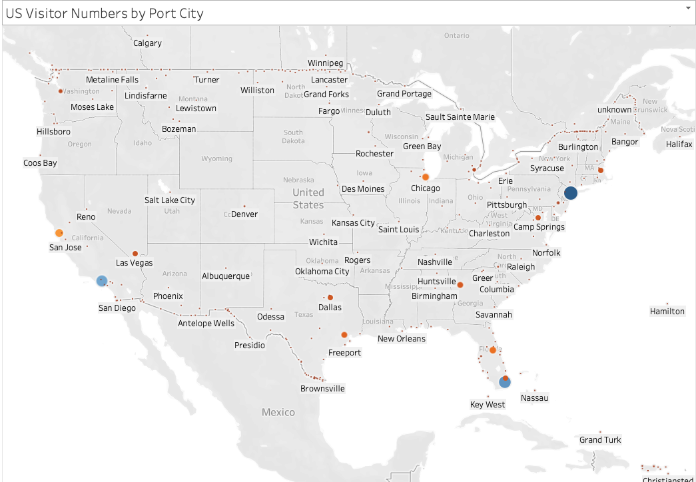
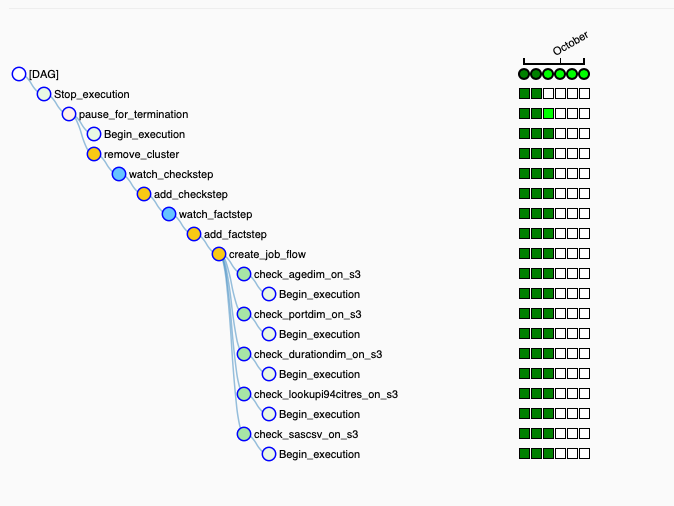
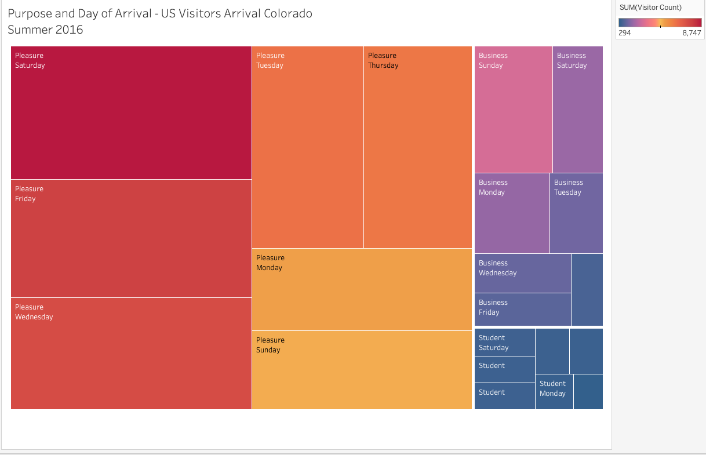

# US Visitors Trial Data Warehouse

Table of Contents
=================

* [Overview](#overview)
* [Steps Taken](#steps-taken)
* [Data Sources](#data-sources)
* [Platform Choices and Justification](#platform-choices-and-justification)
* [Data Model](#data-model)
   * [Discarded Columns](#discarded-columns)
   * [Unknown Port Locations](#unknown-port-locations)
   * [Unknown or Invalid values](#unknown-or-invalid-values)
   * [Ranges for Duration and Age dimensions](#ranges-for-duration-and-age-dimensions)
   * [Data Dictionary](#data-dictionary)
* [Source Code](#source-code)
* [Data Quality Checks](#data-quality-checks)
* [Airflow DAGs](#airflow-dags)
* [S3 Folder structure](#s3-folder-structure)
* [Alternative Data Scenarios](#alternative-data-scenarios)
* [Working with the Data warehouse](#working-with-the-data-warehouse)
* [Conclusion](#conclusion)

## Overview
This is the Capstone project for the Udacity data engineering nanodegree.  The purpose is to utilise skills and tools presented during the program.

The imagined scenario is the creation of an initial trial data warehouse for review by data scientists and data analysts at a consulting company specialising in Travel Business consulting and Tourism Marketing in the US.  The purpose of the data warehouse is threefold:
 * to enable geographical-based analysis and visualisation of foreign visitors to the US   
 * to explore the potential for state-specific data products based around foreign visitors to the US and the potential for combining with other geo-tagged data
 * to enable data scientists to explore the data and provide feedback on improvements and/or extensions to the data presented

 All foreign visitors to the US are required to fill in an I94 arrival/departure record. The primary data set available for the trial data warehouse was the i94 data set of visitors to the US in 2016.  This data set was combined with data defining the ports of entry and their geographical location to produce the trial data warehouse.  

 The trial data warehouse supports analysis of US Visitors to the US by state by visit attributes such as:

   * arrival port
   * visitor age
   * visitor country of residence
   * visit purpose
   * visit duration

The full list of attributes is described in the [Data Dictionary](#data-dictionary).

It also enables geographical visualisations as illustrated in the example below which shows the ports of entry for visitors in 2016:

## Steps Taken

 The project took the following steps:

 

 1. **Initial familiarisation with the i94 data.**  A small amount of data was explored locally in a Jupyter Notebook to get an understanding of the fields in the i94 data set, their types and any missing data in that small set.

 2. **Creation of lookup data sets.** the SAS description file was used to create lookup data sets for ports, first destination state and countries of citizenship and residency. Some basic regular expression matching was used in python in a Jupyter Notebook to separate out the state and the port name to enable future joining against city and state data.  At this stage of the data exploration these new lookup tables were joined with the i94 data again to enable familiarisation with the data set.

 3. **Decide on target platform.**  Taking into account the initial familiarity with the primary data set, the chosen imagined scenario, the technologies that had been covered in the course and the cost implications of various choices it was decided to pursue a solution using S3 for storage, Spark on EMR as the processing platform and Airflow running locally to orchestrate the data processing pipeline.

 3. **Exploration of the airports data set.**  The airports data set appeared useful since it provided latitude and longitude attributes for the airports and therefore fulfilled the requirement of providing geographical information about the ports in which foreign visitors were arriving in the US on flights.  There were several problems in joining the i94 data set with the airport data set including:
    * There was no common key for the ports at which flights were arriving and the airports they represented.  In only a small subset of cases, the port code matched the iata code for the airport.
    * Several of the US cities have multiple international airports: for example, George Bush Intercontinental, William P Hobby and Sugar Land Regional Airports in Houston, Texas all have customs facilities but the two ports in the i94 port data set in Houston are named as "HOUSTON, TX" and "HULL FIELD, SUGAR LAND ARPT, TX" so it would have been misleading to select, for example, the latitude and longitude of George Bush Intercontinental as the geographical location for arrivals at port code "HOU".

 4. **Development of code to obtain airport code for flights.**  Some code was developed to obtain the origin and destination airport iata codes by scraping the flightview.com http response returned from repeated searches using the airline and flight number fields of the i94 data set.  This was an interesting exercise but bore little fruit due to the fact that many of the flight numbers from 2016 were no longer used or had changed.  There are historical flight data sets available at a cost which may have been useful for resolving the arrival locations of international visitors to the US by air however these data sets were not purchased.

 5. **Enrichment of i94 port data set.**  The US cities and world cities data sets were downloaded from Simple Maps at  [https://simplemaps.com/data/us-cities](https://simplemaps.com/data/us-cities) and  [https://simplemaps.com/data/world-cities](https://simplemaps.com/data/world-cities) respectively.  These data sets were joined against the lookup port dataset created earlier to provide, amongst other things, latitude and longitude attributes for the relevant US and world cities.  However, many of the fields remained unmatched and these were then populated using a manual checking of various online sources including:
    * Wikipedia - this provided several Port of Entry matches with their latitude and longitude
    * Google Maps - provided latitude and longitude for several more obscure land crossing points and clarified certain ambiguous names by their geography
    * acukwik.com - resolved some airport queries
    * Google Search - provided a good starting point for more challenging port names

7. **Development of script to move SAS data to S3.** The Udacity work space is secure so, because of the choice of working with Amazon EMR as the processing platform, it was necessary to move the i94 data to S3.  This was done in a python script by reading the data in chunks from the SAS source and transferring multiple CSV files for each month to S3.

8. **Development of data model.**  A data model was developed conceptually then pyspark code was developed locally to create data warehouse tables on spark and write them to parquet format to implement the data model.

9. **Development of Airflow dags** to:
    * check data sources are in place
    * create an EMR cluster
    * add the relevant job steps to the EMR to:
      1. create the fact and dimension tables and write them to S3
      2. check that the parquet files have been created successfully with all the expected data
    * remove the EMR cluster

10. **Execution of Airflow dags to generate the data warehouse parquet files on S3.**

## Data Sources

The following data sources were used in the project:

| Data Source Description | Format |
| ----------------------- | ------ |
| i94 visitor arrival data set | SAS |
| port data set | csv |  
| state data set | csv |
| country data set | csv |
| US cities data set (from simplemaps.com) | csv |
| World cities data set (from simplemaps.com) | csv |

At a high level, from the SAS format i94 data stored in the Udacity workspace to the Data Warehouse files written as parquet format on Amazon S3 the project data pipeline is illustrated below.

## Platform Choices and Justification

The following platforms were used during the project

 

**Amazon S3 and Amazon EMR and Spark for Trial Data Warehouse Platform**

This is a trial system involving Data Scientists and Data Analysts but with a large amount of data. By selecting Amazon EMR and Spark as the platform for Data Scientists this provides them with plenty of flexibility and a platform suitable for the size of the data set plus support for several machine learning algorithms as well the potential to explore graph databases and associated algorithms.  The Data Science team is a small group so access to the system is more easily managed than for the Data Analysts.  

Given the focus on individual US states, it is simple for relevant people in the Data Team to generate low cost csv files on a per state basis using Spark for the Data Analysts to investigate the current Data Warehouse data.  Alternatively, if the Data Analysts wanted more flexibility to work across larger sets of data the partitioning of the data and use of parquet as a storage format is well suited to using Amazon Athena and SQL-style querying that the analysts have some basic familiarity with while still keeping costs under control.  This is a good option for larger scale exploratory work on the trial Data Warehouse.

Once feedback has been received and any schema or aggregation changes implemented it would be possible to update the data pipeline to load the data warehouse into Amazon Redshift.  In fact, by running the pilot study in the Amazon environment this opens up many options moving forward.

Finally, another influencing factor in the choice of Amazon S3 as the final storage platform for the data was the low cost of this solution compared to a Redshift implementation at the outset.

**Parquet format files**

Parquet format files are an efficient means of storing the data for the trial data warehouse for several reasons:

 * the data is compressed which reduces costs
 * although writing of parquet files can be slow, reading is very quick which is a suitable for this write once-read many times scenario
 * the data can be partitioned which can make reading of the data efficient.  This is particularly useful when users are only interested in very clearly defined subsets of data such as individual US states
 * columnar storage improves the efficiency of data reads when filtering by column values
 * data can be appended which is useful in this scenario where data is being processed in months

**Amazon EMR and Spark for ETL Data Processing**

Amazon EMR and Spark were selected for the ETL data processing platform because of the capacity to process large amounts of data, the option to scale up the number of EC2 instances if necessary and the relatively low cost of doing so when the platform due to the fact that the platform can be created and removed on demand.  Within the AWS ecosystem, access to objects on Amazon S3 is straightforward which was an additional plus point in the platform selection.

**Amazon S3 for Staging Area for Data**

Amazon S3 is a relatively low cost storage area for large amounts of data and easily accessible by other systems within the AWS ecosystem.

**Udacity Workspace for i94 SAS Data ETL**

The SAS i94 data set was situated in the Udacity workspace.  This is a secure work space so it was simplest to write a python script in that workspace to perform minimal transformation on the SAS data and then move it as multiple CSV files per month to the Amazon S3 storage.

**Apache Airflow**

Apache airflow contributes a huge amount of control to the data pipeline development and deployment process.  It is valuable to be able to create managed dependencies between tasks, schedule them as required over the months of the data set and then see a visualisation of success or failure.  In particular in this project, creating and removing the Amazon EMR cluster dependent on the completion of the spark tasks was a huge cost saving since the cluster was not left idling.

## Data Model

The final data model is a star schema data warehouse as shown below.  The fact table captures a count of the number of visitors with the given attributes.

 

 This structure was chosen because it is a straightforward structure which supports the construction of simple queries while still providing flexibility for exploratory analysis.   The data fields have been named to provide explanation of meaning, although a data dictionary is also provided below in this section.

 By using this structure analysts will be able to aggregate across many different combinations of values to count the number of visitors with the selected attributes.  These counts can be visualised geospatially by combining with the port dimension thus fulfilling the requirement to enable geographical analysis.

### Discarded Columns

 Throughout the data processing pipeline every effort was made not to discard data or make assumptions about the meaning of the data since the unknown, invalid or outlier fields can be as useful to Data Scientists and Data Analysts at this early stage of understanding the data warehouse as the more obviously meaningful data.

 There were however some choices which were made (assumption is that these decisions would be made by the team before or during project implementation) in discarding columns from the original i94 data set and these were:

 * cicid - the identifier. Irrelevant in any aggregation.
 * i94cit - it is assumed a decision was taken by data analysts that this was less relevant than country of residency
 * count - used for summary statistics but unrequired in this implementation
 * dtadfile, visapost, occup, entdepa, entdepd, entdepu, dtaddto - are all fields that are not used.
 * matflag - the value of this field has a 1 to 1 correlation with whether or not the depdate field is populated
 * biryear - it is assumed that the analysts wanted the age of visitors rather than the year of birth
 * insnum - this value was sparsely populated and not of interest to the data analysts
 * airline - it is assumed a decision was taken by data analysts that they were not interested in airline for this project.
 * fltno - as above.
 * admnum - the admission number. Irrelevant in any aggregation.
 * visatype - it is assumed a decision was taken by data analysts that visatype was not of interest for this project.

### Unknown Port Locations

There are 5 ports for which geographical information could not be found:

| i94port	| udacity port description |
| -------| ------------------------- |
| TST	| NEWINGTON DATA CENTER TEST, CT |
| LIN | 	NORTHERN SVC CENTER, MN |
| 	FOP | 	MORRIS FIELDS AAF, NC |
| NWN	| NEWPORT, VA |
| FER |	FERRY, WA |

Any records specifying this entry port have null values for latitude and longitude.

### Unknown or Invalid values

Any unknown or invalid values in the data set are marked as such in the aggregated data.  The overarching philsophy of the project was that the missing or invalid data can also provide value to the data scientists so one of the data quality checks of the system is to ensure that the total count of visitors across the aggregated data matches the original row count of the SAS source i94 data.

### Ranges for Duration and Age dimensions

It is assumed that the ranges stated for durations and ages defined in the duration and age dimensions were provided by the Data Analysts.  

### Data Dictionary

The data dictionary can be viewed in a separate pdf file: [view data dictionary](doc/datadictionary.pdf)

## Source Code

The following files are used in the data pipeline:

| Filename | Location | Purpose | Execution Platform |
| -------- | -------- | ------- | ------------------ |
| ETL/etl/udacitysas_to_s3csv.py | Udacity | ETL: Udacity i94 SAS data to S3 CSV | Udacity|
| airflow/plugins/operators/s3data_exists.py | Local | Data Check: Check data exists on S3 | Local|
| airflow/plugins/operators/my_emr_add_steps_operator.py | Local | Data processing: Add EMR job step with templated fields | Local|
| airflow/plugins/operators/__ init __.py | Local | Support file | Local|
| airflow/plugins/__ init __.py | Local | Support file | Local|
| airflow/dags/usvisitors_dim.py | Local | Airflow dag definition to check for S3 source files,   create an EMR cluster, create data warehouse  fixed dimensions then remove the cluster. | Local |
| airflow/dags/usvisitors_fact.py | Local | Airflow dag definition to check for S3 source files,  create an EMR cluster, create date dimension   plus fact table then remove the cluster. A final   validity check is also carried out. | Local |
| awsemr/bootstrap_action.sh | S3 | Copy the folder of python scripts from S3 to EMR   when the cluster starts up. | Amazon EMR |
| ETL/etl/usvisitors_dimensions.py  | S3 | Create the port, age and duration dimension tables   in parquet format | Amazon EMR |
| ETL/etl/usvisitors_dimensions.py  | S3 | Create the date dimension table and the visit_fact   tables in parquet format.  | Amazon EMR |
| ETL/etl/checkrowsandcounts_sas_parquet.py  | S3 | Check the source rows match the output visitor counts.  | Amazon EMR |

## Data Quality Checks

Prior to aggregation, the code which executes on spark writes out a summary of all fields and the number of nulls, Nans, unknown values for each field in the data set.

During data processing on EMR in Spark, there is a check after each read command to check that there has been data successfully read from the source.

At the end of the data processing pipeline for each month, the number of rows of the source data is checked against the total sum of visitors in the parquet fact table to ensure that no data has been lost and that every visitor is attributed somewhere.

## Airflow DAGs

There were two DAGs implemented in airflow:

 * the first to check for the data sources required to create port dimension table and then create the port, age and duration dimension tables which are slow changing dimension tables that do not require to be changed for each new month which is processed.
 * the second to check for the data sources required to create the visit_fact table and then create the date dimension table and the visit_fact table and check the validity.  This dag was scheduled to run on a monthly basis with catchup so that the historical data could be processed.

 These are illustrated in the diagrams below:

**US Visitors Dimension DAG**

**US Visitors Fact DAG**

**US Visitors Dimension DAG - Tree View Across Several Months**

## S3 Folder structure

The folder structure on S3 is as follows

There are 3 main folders:

  * **awsemr** - which holds the bootstrap script for which the path is passed as an argument to the emr_create_job_flow_operator in the DAG
  * **data** - which holds all input and output data
  * **python_apps** - which holds the python code which is copied to the EMR cluster on start up

**data folder**

* **analysis** Holds the smaller state-specific csv files extracted from the Data Warehouse for Data Analysts to work with.  For example, the files can be loaded into Tableau and geographically based visualisations can be produced.
* **analytics_data/us_visitors** Holds the US Visitors trial data warehouse parquet files:
  * visit_fact
  * date
  * port
  * age
  * duration
* **lookup_data** Holds the data lookup files which were manually uploaded to S3 and which are used in the generation of the visit_fact table:
  * i94_addr_codes.csv
  * i94cit_i94res_codes.csv
  * i94port_codes.csv
* **pipeline_logs/us_visitors/_year_/_month_** Holds output from the data pipeline code execution on Amazon EMR for each year and month including:
  * a summary of all null or invalid values
  * a summary of the values for all integer fields
  * a summary of the values for all string fields
  * confirmation that the total visitor count written to parquet matches the total number of rows read from the SAS input files.
* **sas_data/_year_/_month_** Holds the csv files resulting from the process of extracting the SAS data from Udacity and writing it to S3 as multiple csv files per month.

## Alternative Data Scenarios

The project rubric asked how alternative scenarios may be tackled.  A discussion of these is included below.

 * **Data increased by 100x**  In this scenario, at the start of the pipeline, when staging the i94 data on S3, it could be split into 100 separate subsets of data within each month.  This would require a logic change to the ETL extracting the data to write each new set of 100 files to a new folder on S3 and for the python code running on spark to be updated to process the separate folders within the month, one folder at at time.

  When it comes to analysis the Data Scientists would make decisions on the filtering and selection of data to enable their analysis. Data Engineers could continue to manage the creation of data subsets in a suitable format for Data Analysts or alternatively provide guidelines for filtering and selection for Athena queries.

 * **Pipelines run on a daily basis**  In this scenario an Airflow dag would be implemented in the Udacity workspace to enable daily transfer of data from the Udacity environment to S3.  The existing Airflow dag running locally would have the schedule amended to daily rather than monthly.

 * **Database needed to be accessed by 100+ people**  The current database can be accessed by 100+ people via Athena however there may be significant cost involved with this volume of data analysis.  However, given an agreement on the final structure of the data warehouse, the data pipeline could be executed with an additional step to copy the data into Redshift where there are means available to support this level of concurrent access.

## Working with the Data warehouse

Several CSV files for individual states were produced as well as one of visitor counts at every port for the whole of 2016.  Some quick visualisations were created in Tableau and those relating to the individual states are shown below.  The visualisation of the ports of entry on the North American continent is included in the [Overview](#overview).

**US Visitors to Colorado Summer 2016 by Country of Residence**

Only the top countries of residence for visitors arriving in Colorado during Summer 2016 (June, July, August) are shown but it is interesting to see that German visitors tended to stay for a relatively long amount of time as well as come in their large numbers. The data could be used to drill down further into the data by visit purpose to see if perhaps the large number of visitors staying for 0-3 days from the UK are mainly business trips.  

**US Visitors to Colorado Summer 2016 by Purpose and Day of Arrival**

This was just an exercise in playing with the Tableau visualisations and illustrates the relative numbers of visitors for a combination of visit purpose and day of arrival.  It doesn't necessarily provide much insight but the colours are great.

**US Visitors to California Summer 2016 by Country of Residence**

Only the top countries of residence are shown for visitors arriving in California in Summer 2016 but again it is interesting that a large number of visitors from China are staying for a longer period than, for example, those from Japan.  Again, looking at visit purpose would be interesting.

**US Visitors to Florida in 2016 by Mode of Arrival**

Beware that the y-axis scales in these charts are vastly different (Air arrivals dwarf Sea and Land arrivalsin scale) however this is a chart of arrivals across all 12 months of 2016 and there are some interesting features including the spike in arrivals by land in April 2016 at all 3 of Florida's top arrival cities.

## Conclusion

The result of the project has been the ability to analyse US Visitor data geographically to gain insight about the visitors and their attributes plus the potential to apply machine learning algorithms to the data perhaps for the creation of clusters for targeted marketing.  It would also be possible to investigate the integration of the data with other geo-spatial data sets for greater insight.  The data team should all be able to work with what has been made available and feedback on positives and negatives thereby fulfilling the project remit.

The use of airflow as the data pipeline orchestrator has been a great asset and any updates resulting from feedback from the data team to increase or reduce the attributes available for analysis will be straightforward to incorporate.
